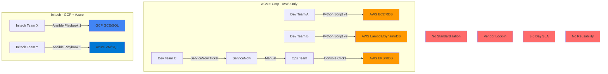
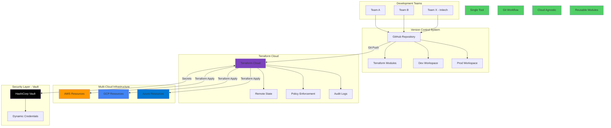
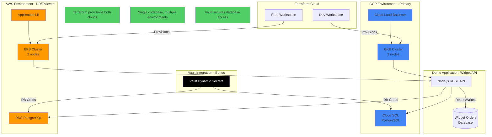
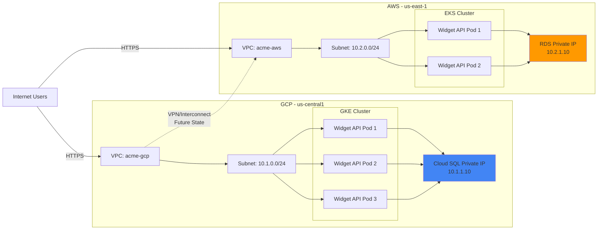
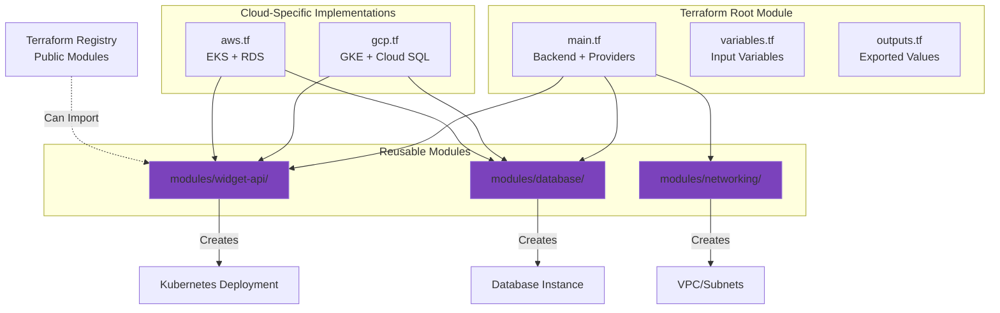
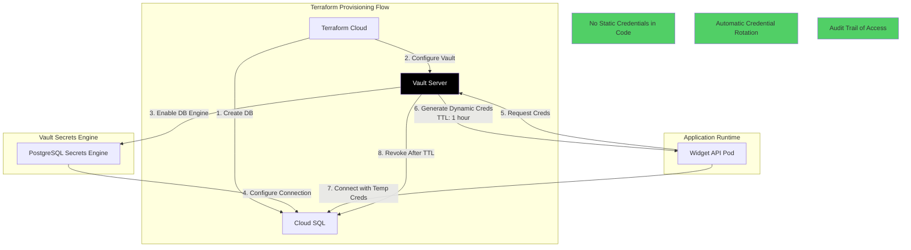

# Architecture Diagrams

## Diagram 1: Current State (The Problem)



## Diagram 2: Proposed Solution (Terraform Platform)



## Diagram 3: Demo Architecture (What We'll Build)



## Diagram 4: Network Topology (Detailed View)



## Diagram 5: Module Structure (Reusability Pattern)



## Diagram 6: Data Flow (Secrets Management with Vault)



---

## Diagram Usage Guide

**Diagram 1 (Current State)**: Use at start of demo to set context. "This is what ACME faces today - fragmented tools, vendor lock-in, slow processes."

**Diagram 2 (Proposed Solution)**: Show after current state. "Here's how Terraform solves these problems - single tool, git workflow, cloud agnostic."

**Diagram 3 (Demo Architecture)**: Show before live demo. "This is exactly what I'm about to build for you live."

**Diagram 4 (Network Topology)**: Use for Cloud Architect deep-dive. Shows you understand networking details.

**Diagram 5 (Module Structure)**: Use for DevOps Engineer. Shows code organization and reusability.

**Diagram 6 (Data Flow)**: Use for bonus Vault integration. Shows platform thinking beyond just Terraform.

---

## Mermaid Rendering Notes

These diagrams are in Mermaid format and can be:
- Rendered in GitHub/GitLab markdown
- Exported to PNG/SVG using Mermaid CLI
- Embedded in presentation slides
- Live-edited during demo if needed

To render locally:
```bash
npm install -g @mermaid-js/mermaid-cli
mmdc -i architecture-diagrams.md -o diagrams/
```
