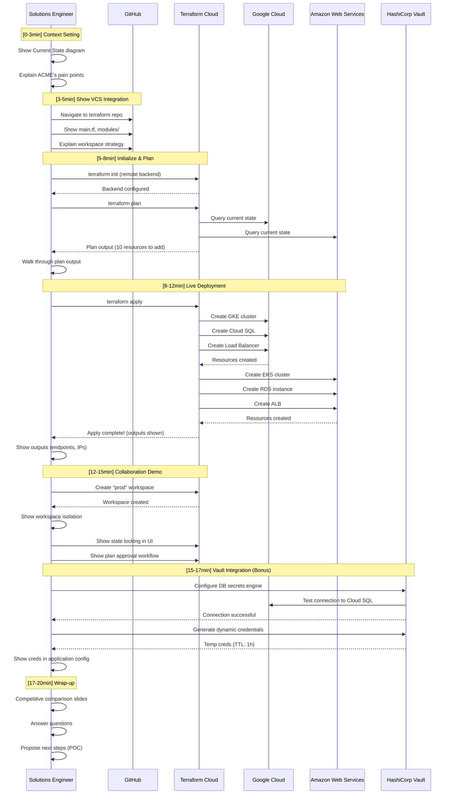
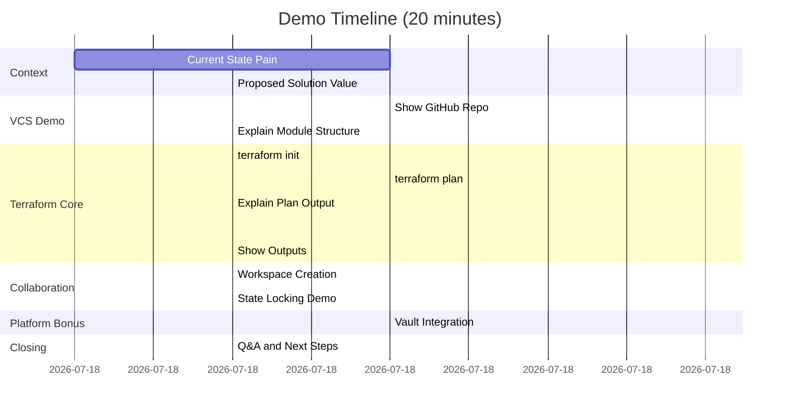
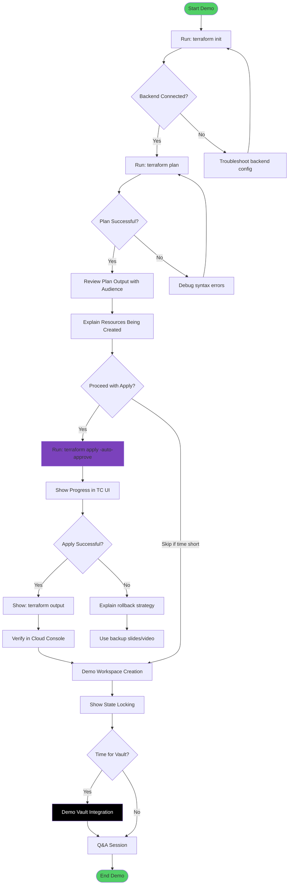
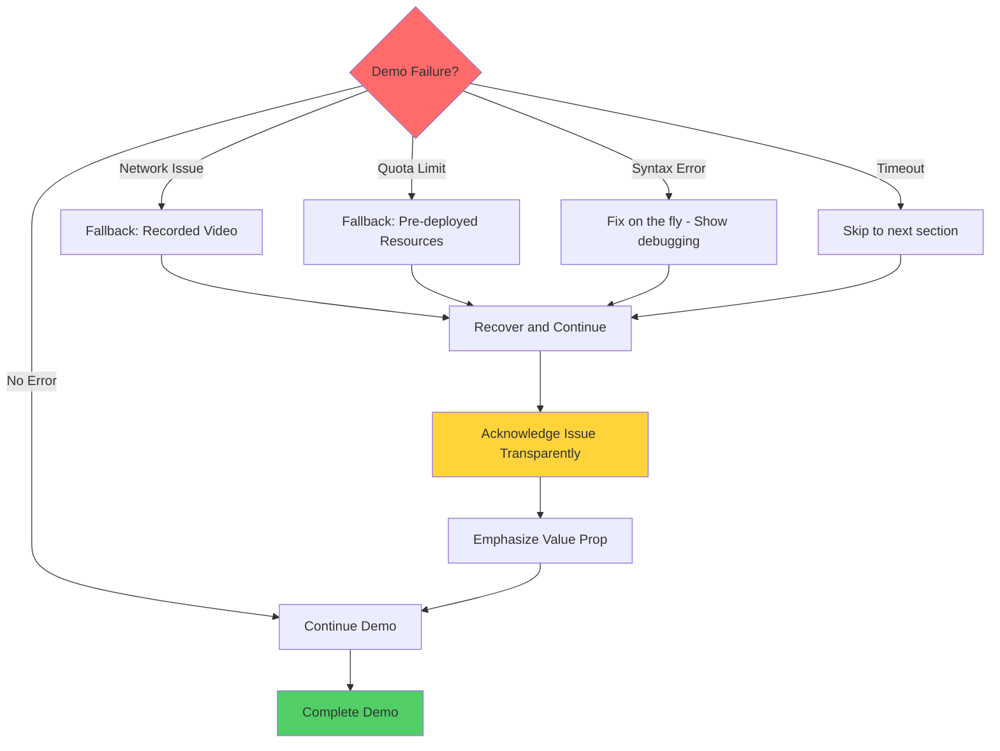
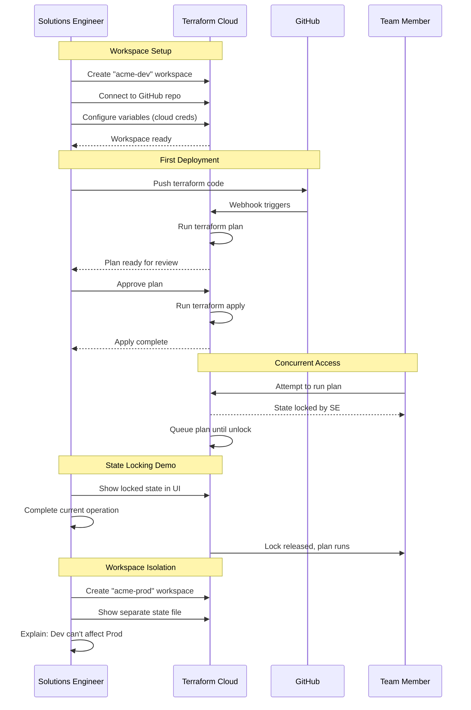
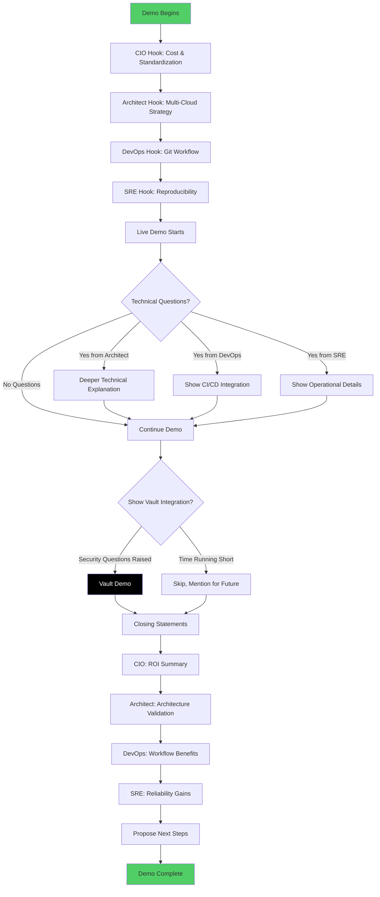
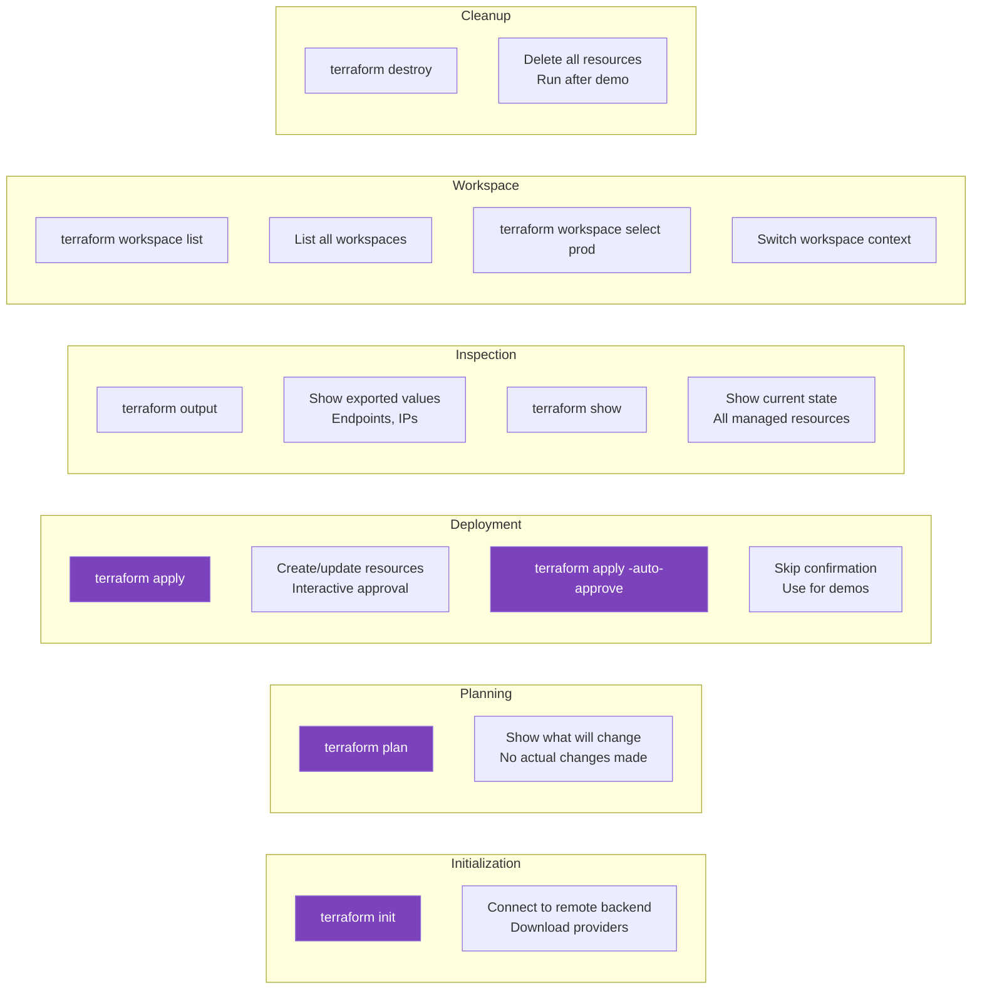

# Demo Flow & Sequence Diagrams

## Demo Sequence Diagram (Complete Flow)



## Detailed Demo Flow (Minute-by-Minute)



## CLI Interaction Flow



## Error Handling Flowchart



## Workspace Collaboration Sequence



## Module Reuse Pattern

```mermaid
flowchart LR
    subgraph "Module Definition"
        MODULE[modules/widget-api/]
        MODULE --> VARS[variables.tf<br/>cloud agnostic inputs]
        MODULE --> MAIN[main.tf<br/>resource definitions]
        MODULE --> OUT[outputs.tf<br/>exported values]
    end
    
    subgraph "GCP Usage"
        GCP_CALL[module "widget_gcp"]
        GCP_CALL --> GCP_VARS[cloud = "gcp"<br/>region = "us-central1"]
        GCP_CALL --> MODULE
        MODULE --> GCP_INFRA[GKE + Cloud SQL]
    end
    
    subgraph "AWS Usage"
        AWS_CALL[module "widget_aws"]
        AWS_CALL --> AWS_VARS[cloud = "aws"<br/>region = "us-east-1"]
        AWS_CALL --> MODULE
        MODULE --> AWS_INFRA[EKS + RDS]
    end
    
    BENEFIT[Same Code, Multiple Clouds]
    
    GCP_INFRA --> BENEFIT
    AWS_INFRA --> BENEFIT
    
    style MODULE fill:#7B42BC
    style BENEFIT fill:#51cf66
```

## Persona Engagement Flow



## Command Cheat Sheet (For Reference During Demo)



---

## Usage During Actual Demo

1. **Keep this file open** on second monitor
2. **Reference sequence diagram** to stay on track
3. **Use gantt chart** to monitor timing
4. **Follow CLI flow** to avoid mistakes
5. **Check error handling** if issues arise

**Pro Tip**: Print the "Command Cheat Sheet" and keep it next to keyboard.
