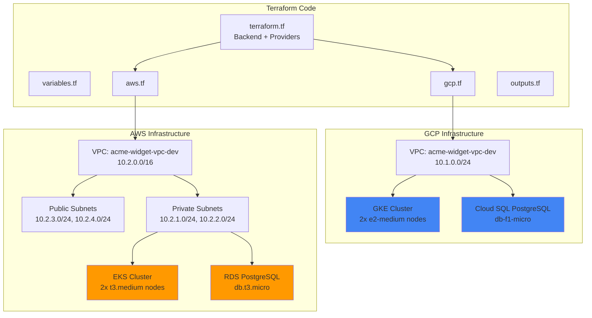
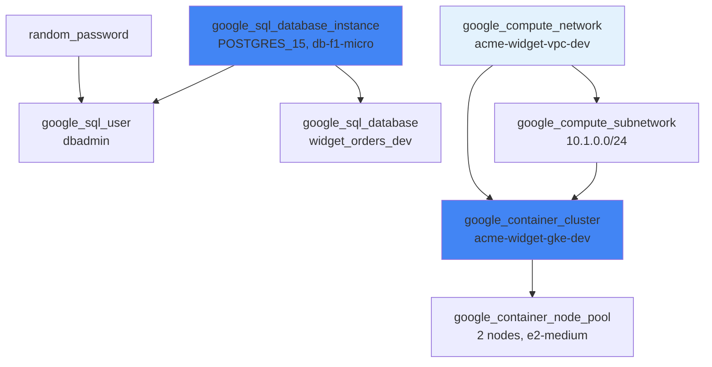
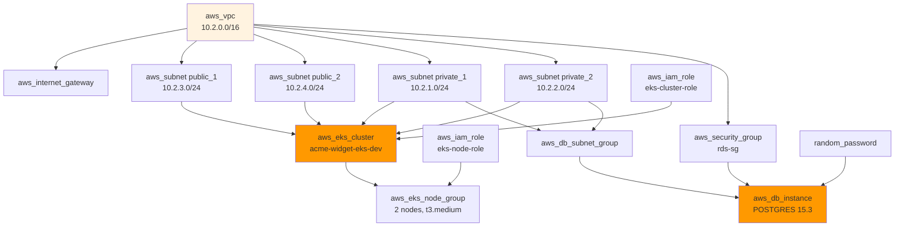
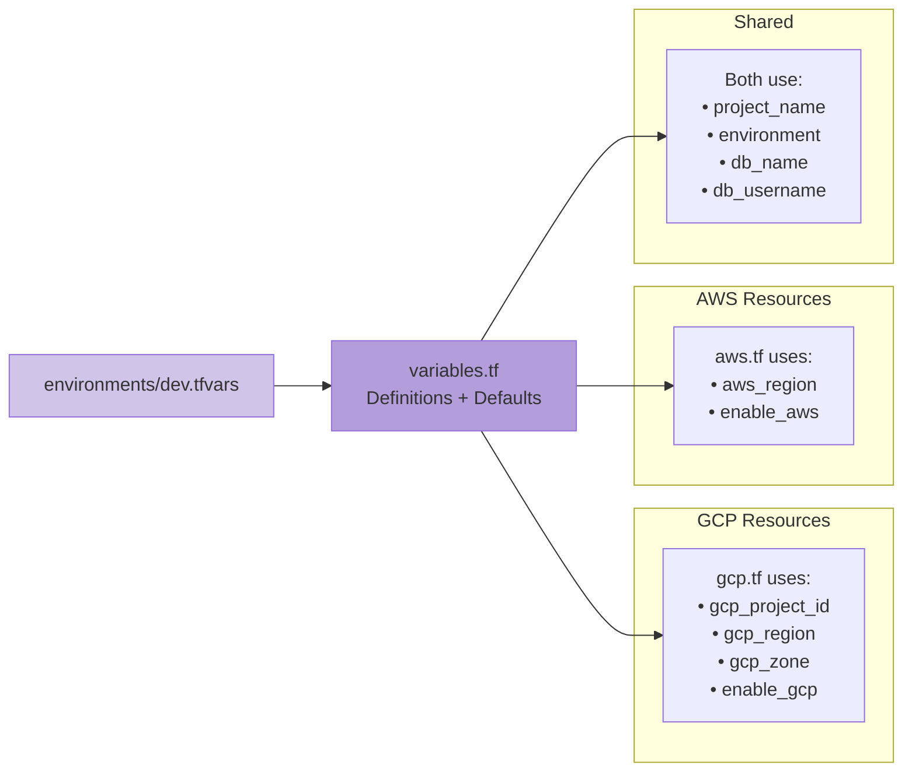
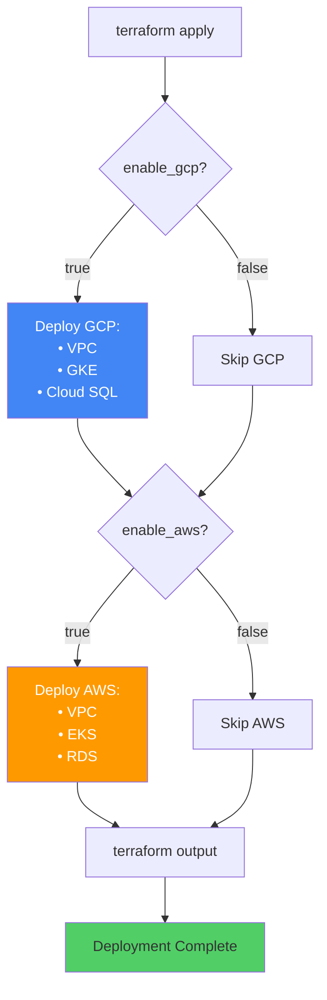
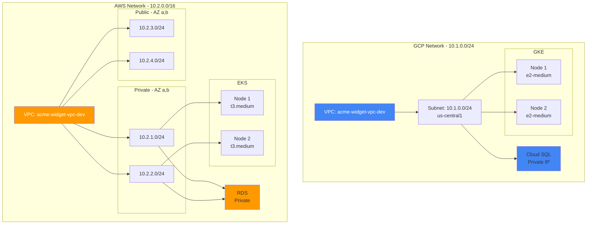
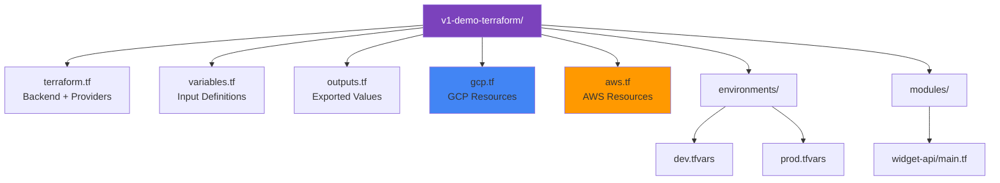

# Architecture Diagrams - v1-demo-terraform

## Diagram 1: High-Level Multi-Cloud Architecture



## Diagram 2: GCP Resource Dependencies



## Diagram 3: AWS Resource Dependencies



## Diagram 4: Terraform Variable Flow



## Diagram 5: Deployment Toggle Pattern



## Diagram 6: Network Architecture Detail



## Diagram 7: File Structure



## Usage Notes

**Diagram 1:** Show for overall architecture overview  
**Diagram 2-3:** Use for technical deep-dive on specific cloud  
**Diagram 4:** Explain variable management strategy  
**Diagram 5:** Demonstrate toggle feature (enable_gcp/enable_aws)  
**Diagram 6:** Detailed networking for architecture discussion  
**Diagram 7:** Code organization and structure  

## Export Commands

```bash
# Install mermaid-cli
npm install -g @mermaid-js/mermaid-cli

# Export diagrams
mmdc -i architecture-v1.md -o diagrams/
```
