# Multi-Cloud Architecture Diagrams - Presentation Version

**Purpose**: Clean, presentation-ready diagrams for demos, interviews, and stakeholder presentations.  
**Version**: 1.2 Production-Ready  
**Last Updated**: October 26, 2025

---

## Executive Overview Diagram

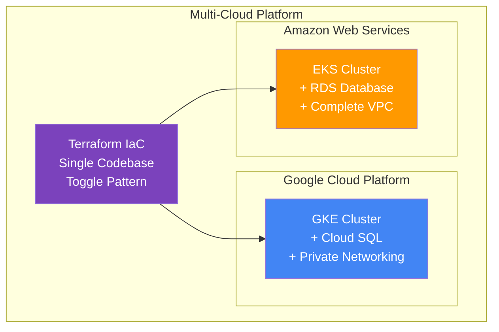

---

## Architecture Pattern: Multi-Cloud Toggle

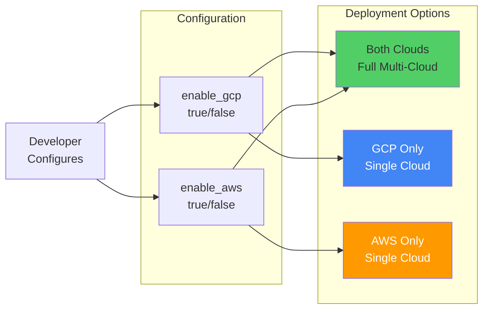

---

## Network Architecture: AWS

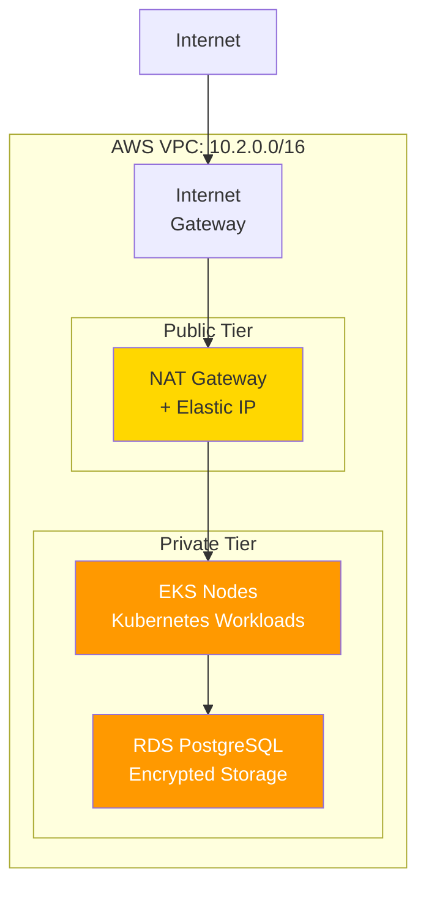

---

## Network Architecture: GCP

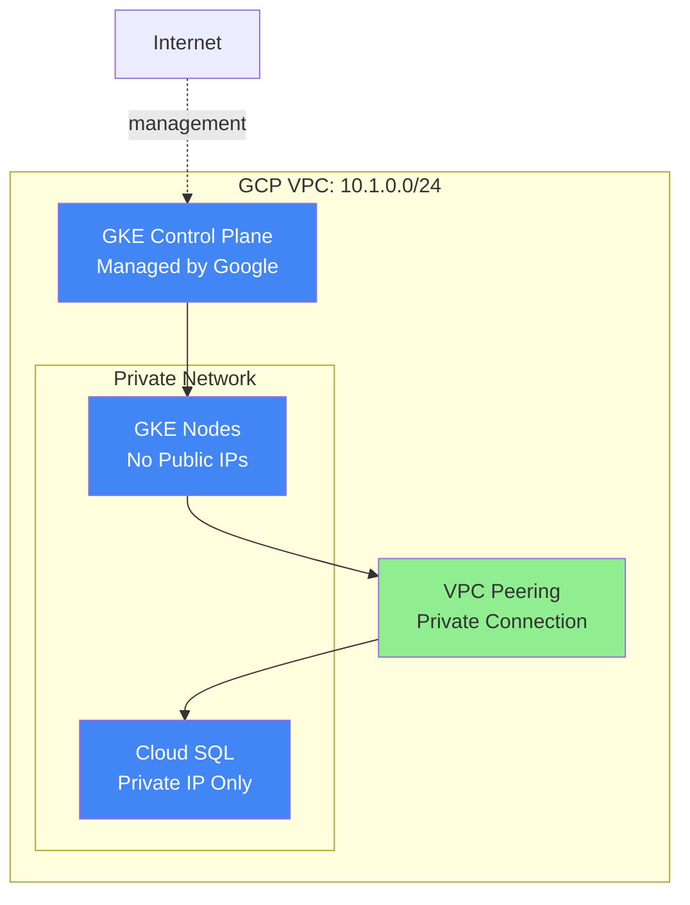

---

## Security Architecture

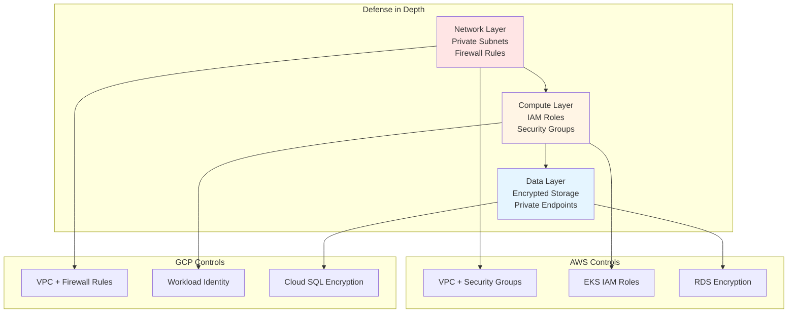

---

## Deployment Workflow

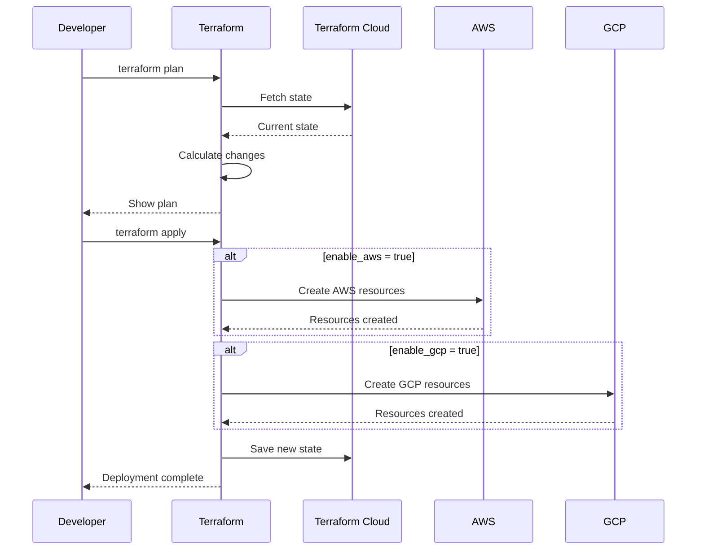

---

## Infrastructure Components

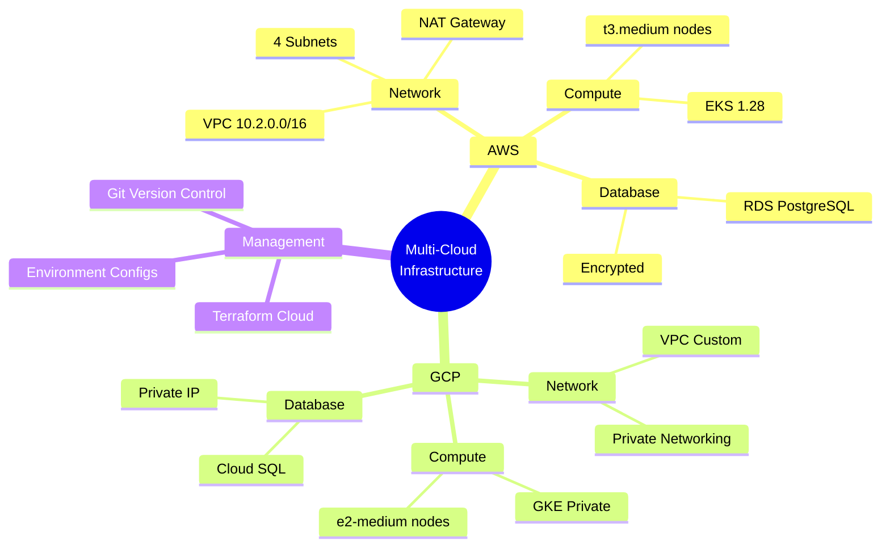

---

## Resource Cost Overview

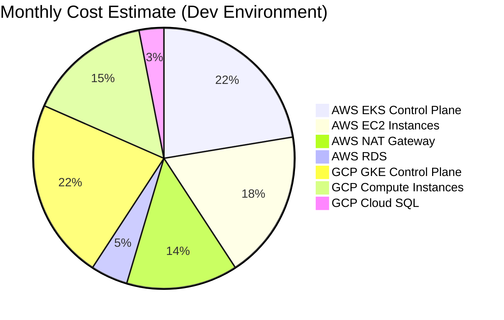

---

## High Availability Design

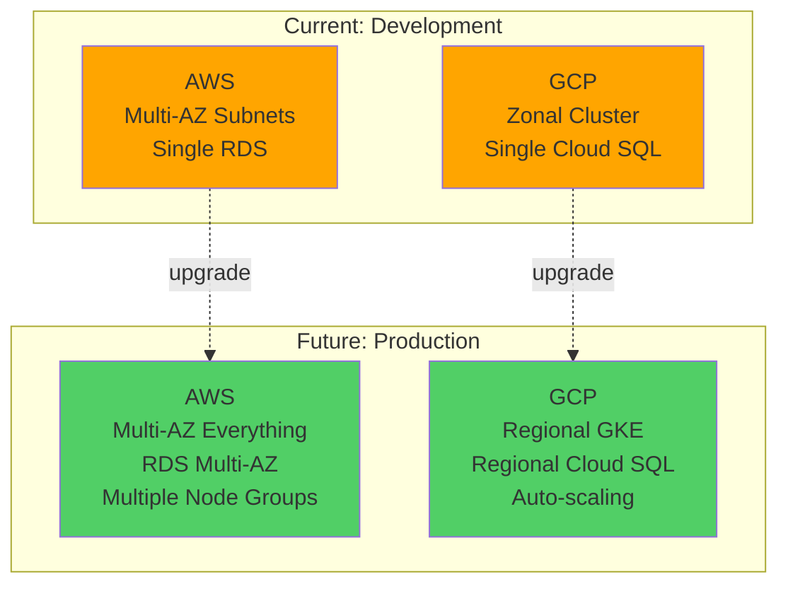

---

## Technical Comparison Matrix

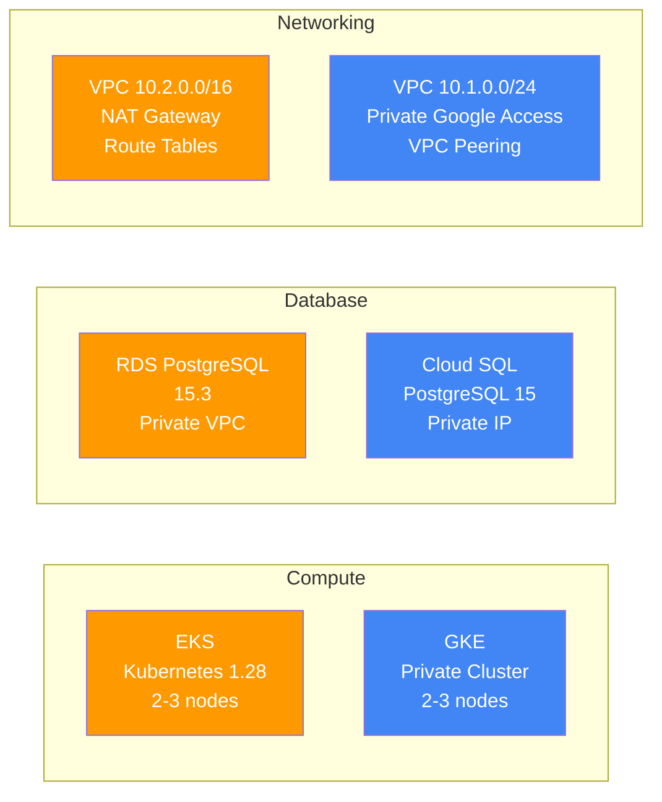

---

## Value Proposition

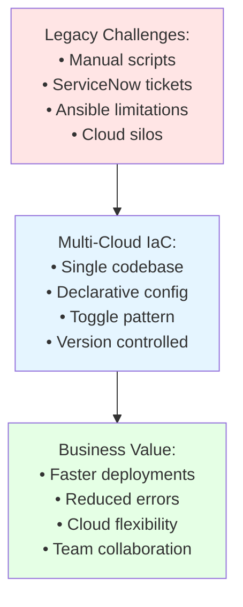

---

## Demo Flow Overview

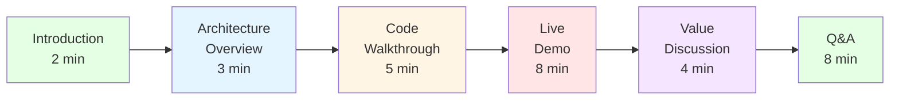

---

## Key Differentiators

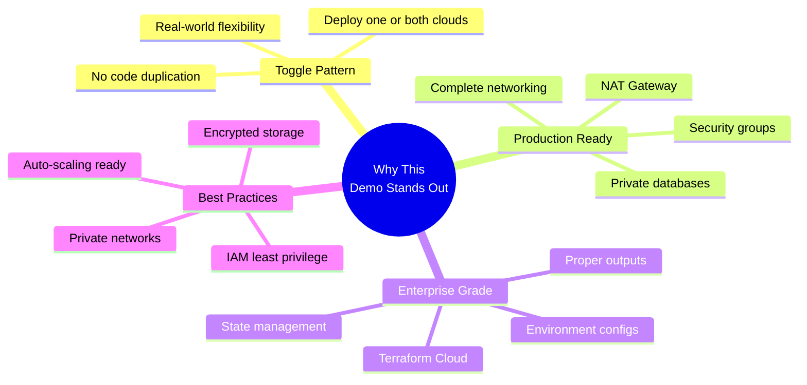

---

## Success Metrics

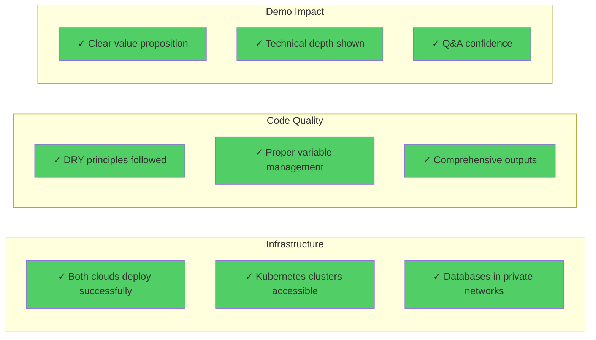

---

## Presentation Tips

### For Technical Interviews
- Start with Diagram 1 (Executive Overview)
- Show Toggle Pattern (Diagram 2)
- Deep dive one cloud network (Diagram 3 or 4)
- Explain security layers (Diagram 5)
- Walk through deployment workflow (Diagram 6)

### For Business Stakeholders
- Focus on Value Proposition (Diagram 10)
- Show cost breakdown (Diagram 8)
- Emphasize HA future state (Diagram 9)
- Discuss toggle flexibility (Diagram 2)

### For Architecture Reviews
- Show both network architectures (Diagrams 3-4)
- Explain security in depth (Diagram 5)
- Compare cloud approaches (Diagram 9)
- Discuss components (Diagram 7)

---

## Quick Reference

| Diagram | Use Case | Duration |
|---------|----------|----------|
| Executive Overview | Opening, context setting | 1-2 min |
| Toggle Pattern | Unique value prop | 2-3 min |
| AWS/GCP Networks | Technical deep dive | 3-4 min each |
| Security Architecture | Security discussion | 3-4 min |
| Deployment Workflow | Process explanation | 2-3 min |
| Components | High-level overview | 1-2 min |
| Cost Overview | Budget discussion | 2-3 min |
| HA Design | Future roadmap | 2-3 min |

---

## Rendering for Presentations

### Export as Images
```bash
# Install mermaid-cli
npm install -g @mermaid-js/mermaid-cli

# Export all diagrams as PNG
mmdc -i DIAGRAMS-FINAL.md -o presentation/ -b transparent

# Export as SVG for better quality
mmdc -i DIAGRAMS-FINAL.md -o presentation/ -b transparent -f svg
```

### Use in Slides
1. Export diagrams as SVG for best quality
2. Insert into PowerPoint/Google Slides/Keynote
3. Add speaker notes referencing ARCHITECTURE.md
4. Practice transitions between diagrams

### Online Rendering
- [Mermaid Live Editor](https://mermaid.live/)
- Paste diagram code
- Export as PNG/SVG/PDF
- Use in presentations

---

## Customization for Your Demo

### Update Organization Names
Find and replace throughout:
- `acme-widget` → Your project name
- `acme-corp` → Your organization name

### Update Regions
Adjust based on your deployment:
- AWS: `us-east-1` → Your region
- GCP: `us-central1` → Your region

### Update Instance Types
Reflect your actual configuration:
- AWS: `t3.medium` → Your instance type
- GCP: `e2-medium` → Your machine type

---

**Document Status**: Ready for Presentation  
**Version**: 1.2 Production-Ready  
**Last Updated**: October 26, 2025  
**Format**: Mermaid Diagrams (renderabale to PNG/SVG/PDF)
