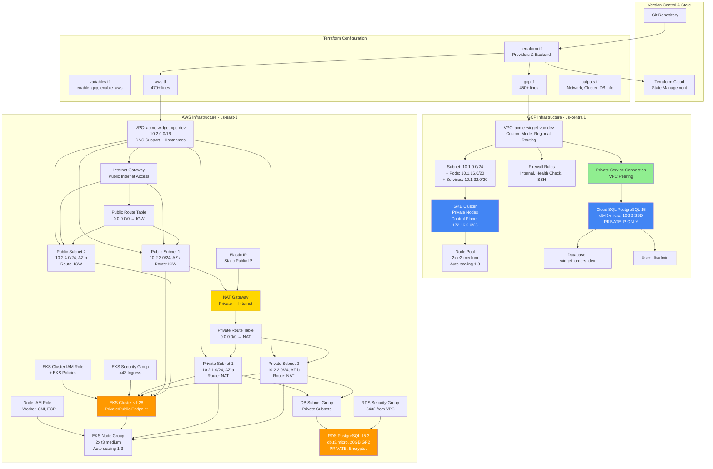
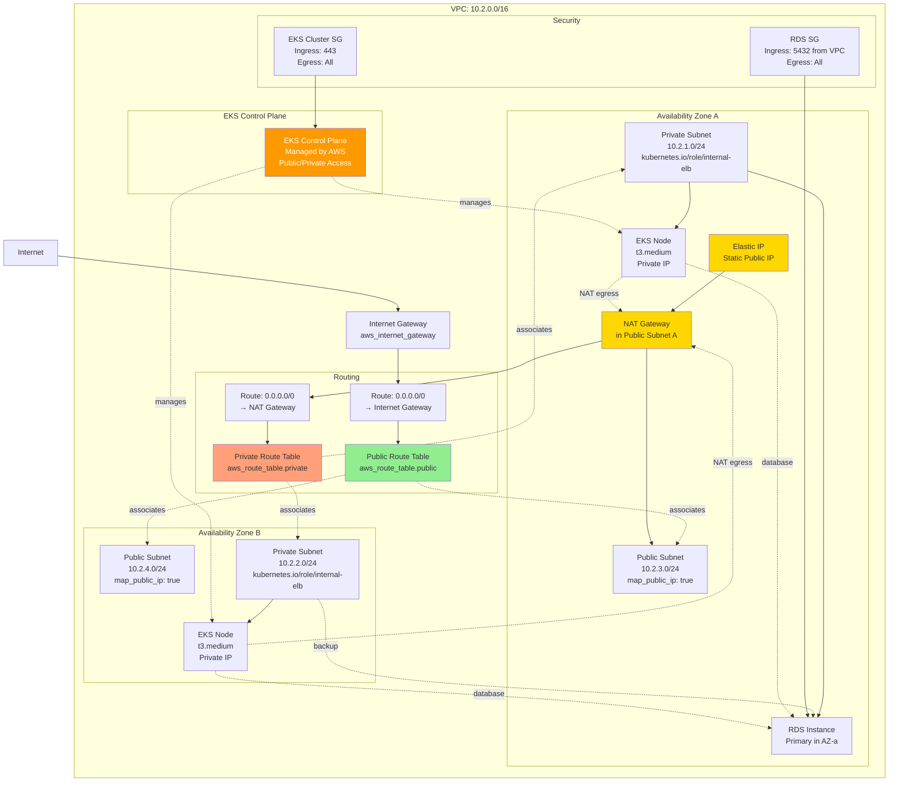
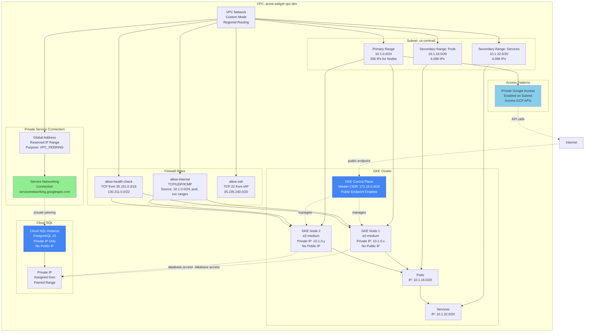
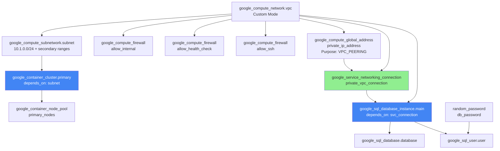
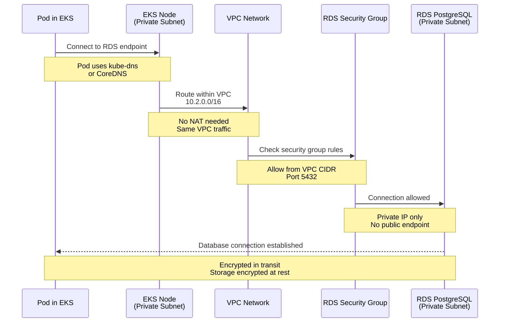
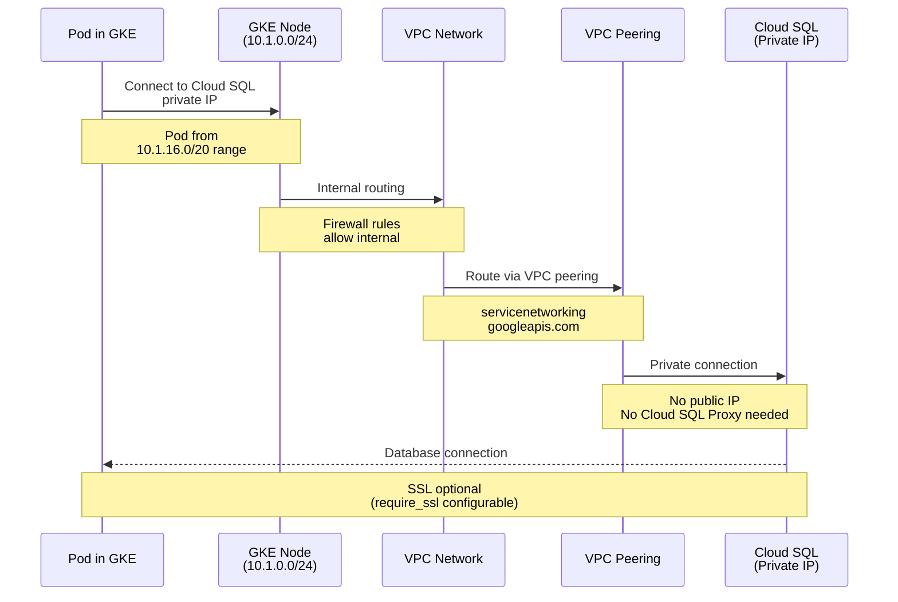
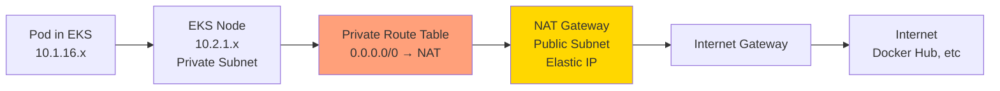
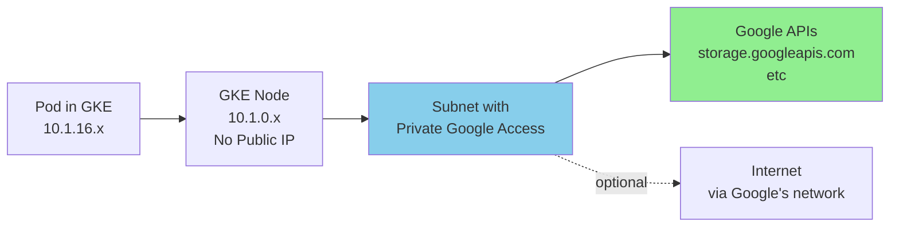
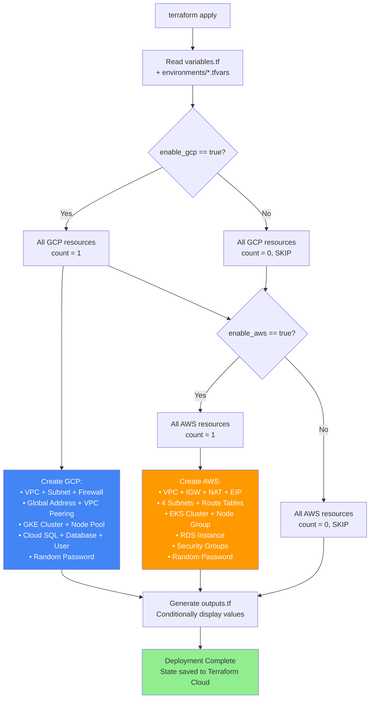

# Technical Architecture Diagrams - Working Reference

**Purpose**: Detailed technical diagrams for engineering teams, architecture reviews, and implementation reference.  
**Version**: 1.2 Current State  
**Last Updated**: October 26, 2025

---

## Diagram 1: Complete Infrastructure Overview



---

## Diagram 2: AWS Network Topology with Routing Details



---

## Diagram 3: GCP Network Topology with Private Service Connection



---

## Diagram 4: Resource Dependency Graph - AWS

```mermaid
graph TD
    VPC[aws_vpc.main<br/>10.2.0.0/16]
    
    IGW[aws_internet_gateway.main]
    EIP[aws_eip.nat<br/>depends_on: IGW]
    
    PUB1[aws_subnet.public_1<br/>10.2.3.0/24]
    PUB2[aws_subnet.public_2<br/>10.2.4.0/24]
    PRIV1[aws_subnet.private_1<br/>10.2.1.0/24]
    PRIV2[aws_subnet.private_2<br/>10.2.2.0/24]
    
    NAT[aws_nat_gateway.main<br/>depends_on: IGW]
    
    RT_PUB[aws_route_table.public]
    RT_PRIV[aws_route_table.private]
    
    RTA_PUB1[aws_route_table_association<br/>public_1]
    RTA_PUB2[aws_route_table_association<br/>public_2]
    RTA_PRIV1[aws_route_table_association<br/>private_1]
    RTA_PRIV2[aws_route_table_association<br/>private_2]
    
    EKS_ROLE[aws_iam_role<br/>eks_cluster]
    EKS_POL1[aws_iam_role_policy_attachment<br/>EKSClusterPolicy]
    EKS_POL2[aws_iam_role_policy_attachment<br/>EKSVPCResourceController]
    EKS_SG[aws_security_group<br/>eks_cluster]
    
    EKS[aws_eks_cluster.main<br/>depends_on: policies]
    
    NODE_ROLE[aws_iam_role<br/>eks_nodes]
    NODE_POL1[aws_iam_role_policy_attachment<br/>WorkerNodePolicy]
    NODE_POL2[aws_iam_role_policy_attachment<br/>CNI_Policy]
    NODE_POL3[aws_iam_role_policy_attachment<br/>ContainerRegistryReadOnly]
    
    NODEGROUP[aws_eks_node_group.main<br/>depends_on: node policies]
    
    DB_SUBNET[aws_db_subnet_group.main]
    RDS_SG[aws_security_group.rds]
    RDS_PASS[random_password<br/>db_password_aws]
    RDS[aws_db_instance.main]
    
    VPC --> IGW
    VPC --> PUB1
    VPC --> PUB2
    VPC --> PRIV1
    VPC --> PRIV2
    VPC --> RT_PUB
    VPC --> RT_PRIV
    VPC --> EKS_SG
    VPC --> RDS_SG
    
    IGW --> EIP
    IGW --> NAT
    EIP --> NAT
    PUB1 --> NAT
    
    IGW --> RT_PUB
    NAT --> RT_PRIV
    
    RT_PUB --> RTA_PUB1
    RT_PUB --> RTA_PUB2
    PUB1 --> RTA_PUB1
    PUB2 --> RTA_PUB2
    
    RT_PRIV --> RTA_PRIV1
    RT_PRIV --> RTA_PRIV2
    PRIV1 --> RTA_PRIV1
    PRIV2 --> RTA_PRIV2
    
    EKS_ROLE --> EKS_POL1
    EKS_ROLE --> EKS_POL2
    EKS_POL1 --> EKS
    EKS_POL2 --> EKS
    EKS_SG --> EKS
    PRIV1 --> EKS
    PRIV2 --> EKS
    PUB1 --> EKS
    PUB2 --> EKS
    
    NODE_ROLE --> NODE_POL1
    NODE_ROLE --> NODE_POL2
    NODE_ROLE --> NODE_POL3
    NODE_POL1 --> NODEGROUP
    NODE_POL2 --> NODEGROUP
    NODE_POL3 --> NODEGROUP
    EKS --> NODEGROUP
    PRIV1 --> NODEGROUP
    PRIV2 --> NODEGROUP
    
    PRIV1 --> DB_SUBNET
    PRIV2 --> DB_SUBNET
    DB_SUBNET --> RDS
    RDS_SG --> RDS
    RDS_PASS --> RDS
    
    style NAT fill:#FFD700
    style EKS fill:#FF9900,color:#fff
    style RDS fill:#FF9900,color:#fff
```



---

## Diagram 5: Resource Dependency Graph - GCP



---

## Diagram 6: Traffic Flow - Kubernetes Pod to Database

### AWS EKS to RDS



### GCP GKE to Cloud SQL



---

## Diagram 7: Internet Egress Patterns

### AWS - NAT Gateway Egress



### GCP - Private Google Access



---

## Diagram 8: Conditional Resource Creation Logic



---

## Diagram 9: File Structure and Module Organization

```mermaid
graph TB
    ROOT[v1-demo-terraform/]
    
    subgraph "Core Configuration"
        TF[terraform.tf<br/>• Backend: Terraform Cloud<br/>• Providers: aws ~5.0, google ~5.0<br/>• kubernetes ~2.23]
        VARS[variables.tf<br/>• enable_gcp, enable_aws<br/>• regions, zones, project IDs<br/>• database config]
        OUT[outputs.tf<br/>• VPC/Network details<br/>• Cluster endpoints<br/>• Database connections]
    end
    
    subgraph "Cloud Resources"
        GCP[gcp.tf (366 lines)<br/>• VPC + Subnet + Secondary ranges<br/>• Firewall rules (3)<br/>• Private service connection<br/>• GKE + Node pool<br/>• Cloud SQL + DB + User]
        
        AWS[aws.tf (472 lines)<br/>• VPC + IGW + NAT + EIP<br/>• 4 Subnets + 2 Route Tables<br/>• 4 Route table associations<br/>• EKS + Node group<br/>• IAM roles (2) + policies (5)<br/>• RDS + Security groups (2)]
    end
    
    subgraph "Environment Configs"
        ENV_DIR[environments/]
        DEV[dev.tfvars<br/>• environment = dev<br/>• enable_gcp = true<br/>• enable_aws = true]
        PROD[prod.tfvars<br/>• environment = prod<br/>• enable_gcp = true<br/>• enable_aws = true]
    end
    
    subgraph "Modules (Future)"
        MOD_DIR[modules/]
        API[widget-api/<br/>• main.tf (placeholder)<br/>• Variables for K8s deployment]
    end
    
    subgraph "Documentation"
        README[README.md<br/>Getting Started Guide]
        ARCH[ARCHITECTURE.md<br/>Design & Decisions]
        SETUP[SETUP.md<br/>Detailed Setup]
        GITIGNORE[.gitignore<br/>Terraform artifacts]
    end
    
    ROOT --> TF
    ROOT --> VARS
    ROOT --> OUT
    ROOT --> GCP
    ROOT --> AWS
    ROOT --> ENV_DIR
    ROOT --> MOD_DIR
    ROOT --> README
    ROOT --> ARCH
    ROOT --> SETUP
    ROOT --> GITIGNORE
    
    ENV_DIR --> DEV
    ENV_DIR --> PROD
    
    MOD_DIR --> API
    
    style GCP fill:#4285F4,color:#fff
    style AWS fill:#FF9900,color:#fff
    style ROOT fill:#7B42BC,color:#fff
```

---

## Notes for Engineering Teams

### Using These Diagrams

1. **Diagram 1**: Start here for overall system understanding
2. **Diagrams 2-3**: Network architecture details for troubleshooting
3. **Diagrams 4-5**: Resource dependencies for understanding creation order
4. **Diagrams 6-7**: Traffic patterns for security reviews
5. **Diagram 8**: Logic flow for understanding toggle mechanism
6. **Diagram 9**: Code organization for new team members

### Rendering These Diagrams

```bash
# Using mermaid-cli
npm install -g @mermaid-js/mermaid-cli

# Render all diagrams
mmdc -i DIAGRAMS-WORKING.md -o output/

# Or use online renderer
# https://mermaid.live/
```

### Updating These Diagrams

When infrastructure changes:
1. Update the affected diagram(s)
2. Update version number in header
3. Add note to version history
4. Run terraform plan to verify
5. Update ARCHITECTURE.md if needed

---

**Version**: 1.2 Current State  
**Last Updated**: October 26, 2025  
**Maintained by**: Engineering Team
